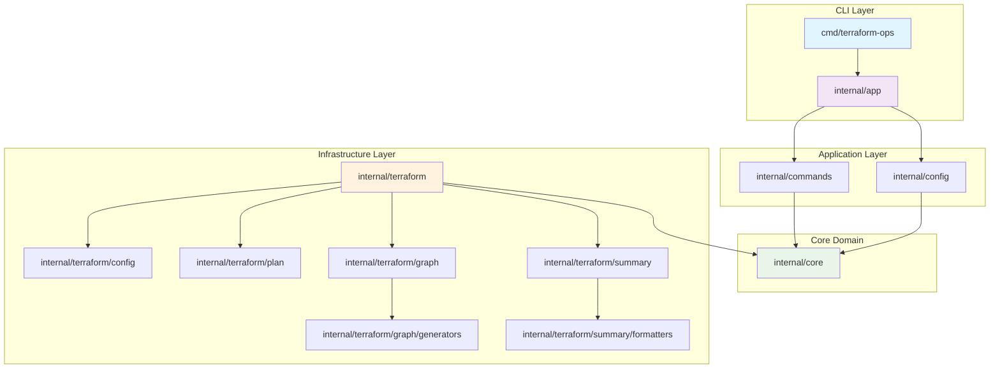
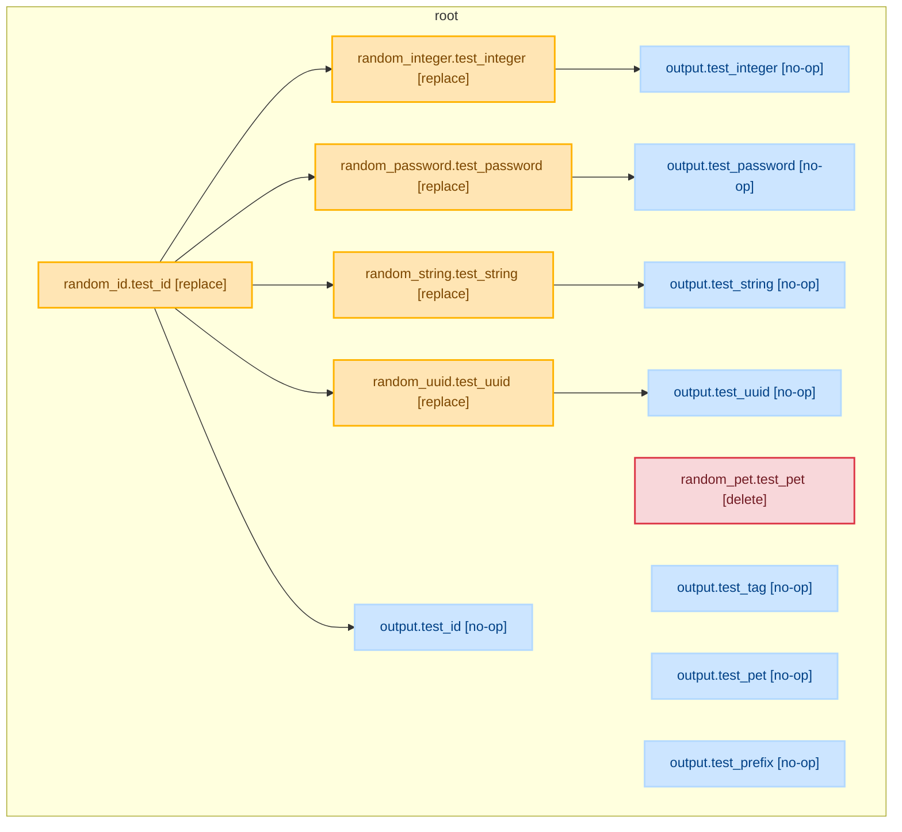

# terraform-ops

A command-line interface tool for managing Terraform operations and workflows. This tool provides utilities to inspect and analyze Terraform configurations across multiple workspaces.

## Features

- **Terraform Block Analysis**: Extract and display information from Terraform configuration blocks
- **Plan Graph Generation**: Generate visual dependency graphs from Terraform plan files
- **Plan Summarization**: Generate human-readable summaries of Terraform plan changes with multiple output formats
- **Multi-workspace Support**: Process multiple Terraform workspaces in a single command
- **Machine-readable Output**: JSON format for easy integration with scripts and tools
- **Non-recursive Scanning**: Focus on workspace root directories for efficient processing
- **Error Resilience**: Continue processing remaining workspaces even if individual ones fail
- **Multiple Graph Formats**: Support for Graphviz, Mermaid, and PlantUML formats
- **Multiple Summary Formats**: Support for text, JSON, markdown, table, and Terraform plan-like formats
- **GitHub Action Integration**: Ready-to-use GitHub Action for CI/CD workflows
- **Dynamic Plan Processing**: Support for both static and dynamically generated Terraform plans
- **Clean Architecture**: Well-structured codebase following Go best practices and clean architecture principles

## Architecture Overview

The project follows clean architecture principles with clear separation of concerns:



### Key Architectural Principles

- **Dependency Injection**: All major components accept interfaces rather than concrete implementations
- **Single Responsibility**: Each function/class has one clear purpose
- **Interface Segregation**: Small, focused interfaces for easy testing and component swapping
- **Error Handling**: Comprehensive error types with proper context preservation
- **Testability**: All components are easily unit testable with >80% code coverage
- **Extensibility**: Easy to add new graph formats, summary formats, and features

## Installation

### Using Homebrew (Recommended)

```shell
# Add the custom tap
brew tap yu/terraform-ops

# Install terraform-ops
brew install terraform-ops
```

**Note**: You'll need to create a `homebrew-terraform-ops` repository first. See [Homebrew Installation Guide](docs/homebrew.md) for detailed setup instructions.

### From Source

```shell
git clone https://github.com/yu/terraform-ops.git
cd terraform-ops
make install
```

### Using Go Install

```shell
go install github.com/yu/terraform-ops@latest
```

### Building from Source

```shell
# Build for current platform
make build

# Build for multiple platforms
make build-all

# Development with live reload (requires air)
make dev
```

## Usage

### `show-terraform`

Display information from the terraform block in workspaces.

```shell
terraform-ops show-terraform <path1> <path2>
```

#### Examples

**Basic usage with multiple workspaces:**

```shell
terraform-ops show-terraform ./workspace1 ./workspace2 ./workspace3
```

**Example output:**

```json
[
  {
    "path": "/absolute/path/to/workspace1",
    "terraform": {
      "required_version": ">= 1.4.0, < 2.0.0",
      "backend": {
        "type": "gcs",
        "config": {
          "bucket": "terraform-state-prod",
          "prefix": "terraform/state",
          "impersonate_service_account": "test-service-account@terraform-ops-test.iam.gserviceaccount.com"
        }
      },
      "required_providers": {
        "google": "~> 4.0",
        "random": ""
      }
    }
  },
  {
    "path": "/absolute/path/to/workspace2",
    "terraform": {
      "required_version": ">= 1.0.0",
      "backend": {
        "type": "s3",
        "config": {
          "bucket": "my-bucket",
          "key": "path/to/state.tfstate",
          "region": "us-east-1",
          "encrypt": "true"
        }
      },
      "required_providers": {
        "aws": ">=4.83.0,<5.0.0"
      }
    }
  }
]
```

#### Output Fields

The `show-terraform` command inspects Terraform configuration files (\*.tf) in the specified paths and outputs information contained in the terraform block:

- **`path`** – Absolute path of the scanned workspace directory
- **`terraform.required_version`** – The Terraform CLI version constraint string (empty when not declared)
- **`terraform.backend`** – Backend type and key-value settings (omitted when no backend block is present)
  - **`type`** – Backend type (e.g., "s3", "gcs", "azurerm")
  - **`config`** – Key-value configuration settings (only primitive values: string, number, bool). Includes all optional fields like `impersonate_service_account` for GCS backends.
- **`terraform.required_providers`** – The set of required providers and their declared version constraints (empty object when no providers are declared)

#### Behavior

- **Non-recursive**: Only scans `.tf` files directly in the specified directories (no subdirectory traversal)
- **Error handling**: Individual workspace errors are printed to stderr but don't stop processing of remaining paths
- **JSON output**: All information is returned in a machine-readable JSON array – one element per inspected workspace
- **Order preservation**: Results are returned in the same order as the input paths

### `summarize-plan`

Generate a human-readable summary of Terraform plan changes for the given workspace. The summary provides a clear overview of all resource changes, organized by action type (create, update, delete, replace), with statistics and breakdowns by provider, module, and resource type.

```shell
terraform-ops summarize-plan <PLAN_FILE> [OPTIONS]
```

#### Basic Examples

**Basic usage:**

```shell
# Generate text summary from plan file
terraform-ops summarize-plan plan.json

# Generate markdown summary
terraform-ops summarize-plan --format markdown plan.json

# Generate JSON summary for scripting
terraform-ops summarize-plan --format json plan.json

# Generate Terraform plan-like output
terraform-ops summarize-plan --format plan plan.json

# Save to file
terraform-ops summarize-plan --output summary.md plan.json
```

**Advanced Examples:**

```shell
# Group by provider instead of action
terraform-ops summarize-plan --group-by provider plan.json

# Show detailed change information
terraform-ops summarize-plan --show-details plan.json

# Compact output format
terraform-ops summarize-plan --compact plan.json

# Hide sensitive value indicators
terraform-ops summarize-plan --no-sensitive plan.json

# Force color output
terraform-ops summarize-plan --color always plan.json
```

**Workflow Integration Examples:**

```shell
# Generate plan and create summary in one workflow
terraform plan -out=plan.tfplan
terraform show -json plan.tfplan > plan.json
terraform-ops summarize-plan plan.json > plan-summary.txt

# Create markdown summary for PR reviews
terraform-ops summarize-plan --format markdown plan.json > plan-summary.md

# Generate JSON summary for automation
terraform-ops summarize-plan --format json plan.json > plan-summary.json
```

#### Options

- `--format, -f <FORMAT>`: Output format (default: "text")
  - Supported formats: `text`, `json`, `markdown`, `table`, `plan`
- `--output, -o <FILE>`: Output file path (default: stdout)
- `--group-by, -g <GROUPING>`: Grouping strategy (default: "action")
  - Supported groupings: `action`, `module`, `provider`, `resource_type`
- `--no-sensitive`: Hide sensitive value indicators
- `--compact, -c`: Compact output format
- `--verbose, -v`: Enable verbose output for debugging
- `--show-details`: Show detailed change information
- `--color <MODE>`: Color output mode (default: "auto")
  - Supported modes: `auto`, `always`, `never`

#### Supported Output Formats

- **Text Format** (default): Human-readable console output with emojis and clear sections
- **JSON Format**: Machine-readable structured data for automation and scripting
- **Markdown Format**: GitHub-compatible markdown for documentation and PR reviews
- **Table Format**: Tabular format for easy parsing and analysis
- **Plan Format**: Terraform plan-like output that mimics the standard Terraform plan output

#### Output Structure

The summary includes:

- **Plan Information**: Format version, applicability, completion status
- **Statistics**: Total changes with breakdowns by action, provider, resource type, and module
- **Resource Changes**: Grouped by action type (create, update, delete, replace, no-op)
- **Output Changes**: Changes to output values
- **Sensitive Data Handling**: Clear indication of resources with sensitive values

#### Example Outputs

**Text Format:**

```text
Terraform Plan Summary
======================

📊 Statistics
-------------
Total Changes: 8

By Action:
  ➕ create: 7
  ❌ delete: 6

By Provider:
  🏢 random: 8

🔄 Resource Changes
-------------------

➕ Create (2)
--------------
  module.myrandom.random_integer.test_integer
  module.myrandom.random_string.test_string

🔄 Replace (5)
----------------
  random_id.test_id
  random_password.test_password
    🔒 Contains sensitive values
```

**Plan Format:**

```text
Terraform will perform the following actions:

  # module.myrandom.random_integer.test_integer will be created
  + resource "random_integer" "test_integer" {
    }

  # random_password.test_password must be replaced
-/+ resource "random_password" "test_password" {
      # (sensitive value)
    }

Plan: 7 to add, 0 to change, 6 to destroy.
```

### `plan-graph`

Generate a visual graph representation of Terraform plan changes for the given workspace. The generated graph shows relationships between resources, grouped by modules, with clear indication of resource lifecycle changes (create, update, delete).

```shell
terraform-ops plan-graph <PLAN_FILE> [OPTIONS]
```



#### Basic Examples

**Basic usage:**

```shell
# Generate Graphviz graph from plan file
terraform-ops plan-graph plan.json

# Generate Mermaid graph
terraform-ops plan-graph --format mermaid plan.json

# Save to file
terraform-ops plan-graph --output graph.dot plan.json
```

**Advanced Examples:**

```shell
# Generate compact graph with specific grouping
terraform-ops plan-graph --compact --group-by action plan.json

# Exclude specific elements
terraform-ops plan-graph --no-data-sources --no-outputs plan.json

# Verbose output for debugging
terraform-ops plan-graph --verbose plan.json
```

**Workflow Integration Examples:**

```shell
# Generate plan and create graph in one workflow
terraform plan -out=plan.tfplan
terraform show -json plan.tfplan > plan.json
terraform-ops plan-graph plan.json > infrastructure-graph.dot
dot -Tpng infrastructure-graph.dot -o infrastructure-graph.png
```

#### Options

- `--format <FORMAT>`: Output format (default: "graphviz")
  - Supported formats: `graphviz`, `mermaid`, `plantuml`
- `--output <FILE>`: Output file path (default: stdout)
- `--group-by <GROUPING>`: Grouping strategy (default: "module")
  - Supported groupings: `module`, `action`, `resource_type`
- `--no-data-sources`: Exclude data source resources from the graph
- `--no-outputs`: Exclude output values from the graph
- `--no-variables`: Exclude variable values from the graph
- `--no-locals`: Exclude local values from the graph
- `--compact`: Generate a more compact graph layout
- `--verbose`: Enable verbose output for debugging

#### Supported Graph Visualization Tools

- **[Graphviz](https://graphviz.org/)**: Industry-standard graph visualization tool
  - Supports complex layouts and styling
  - Excellent for large infrastructure graphs
  - Can generate PNG, SVG, PDF outputs
- **[Mermaid](https://mermaid.js.org/)**: Modern diagramming tool
  - Web-based rendering
  - Good for documentation and web interfaces
  - Supports interactive features
- **[PlantUML](https://plantuml.com/)**: UML-focused diagramming
  - Clean, professional appearance
  - Good for documentation
  - Supports various output formats

#### Node Types and Visual Representation

- **Resources**: House shapes (with action-based colors)
  - **CREATE** (`actions: ["create"]`): Resources to be created (Light Blue)
  - **UPDATE** (`actions: ["update"]`): Resources to be modified (Blue)
  - **DELETE** (`actions: ["delete"]`): Resources to be destroyed (Red)
  - **REPLACE** (`actions: ["delete", "create"]`): Resources to be recreated (Orange)
  - **NO-OP** (`actions: ["no-op"]`): No changes planned (Light Steel Blue)
- **Data Sources**: Cyan diamonds
- **Outputs**: Light Steel Blue inverted houses (exports)
- **Variables**: Yellow cylinders (inputs)
- **Locals**: Pink octagons (computed values)

#### GitHub Action Integration

The project includes a GitHub Action for generating plan graphs in CI/CD workflows:

```yaml
- name: Generate Terraform Plan Graph
  uses: yu/terraform-ops/actions/plan-graph@v1
  with:
    plan-file: "plan.json"
    format: "mermaid"
    group-by: "module"
    show-outputs: "true"
    compact: "false"
```

See [actions/plan-graph/README.md](actions/plan-graph/README.md) for detailed usage instructions.

#### CI/CD Workflows

The project includes comprehensive GitHub Actions workflows for automated testing, building, and releasing:

##### Available Workflows

- **Unit Tests** (`.github/workflows/unit_tests.yml`): Runs unit tests on pull requests and pushes
- **Integration Tests** (`.github/workflows/integration_tests.yml`): Tests against multiple Terraform versions (1.7.0-1.12.0)
- **Code Quality** (`.github/workflows/trunk_check.yml`): Runs linting, formatting, and security checks
- **Release** (`.github/workflows/release.yml`): Automatically builds and releases binaries when tags are pushed
- **Dependency Updates** (`.github/dependabot.yml`): Monthly updates for GitHub Actions and Go modules

##### Automated Testing Matrix

The integration tests run against multiple Terraform versions to ensure compatibility:

- Terraform 1.7.0 through 1.12.0
- Tests `show-terraform`, `plan-graph`, and `summarize-plan` commands
- Validates against various workspace configurations
- **Dynamic plan generation** for realistic test scenarios

##### Release Process

1. **Tag a Release**: `git tag v1.0.0 && git push origin v1.0.0`
2. **Automated Build**: GitHub Actions builds for all platforms:
   - Linux AMD64
   - macOS AMD64/ARM64
   - Windows AMD64
3. **Release Creation**: Automatically creates GitHub release with binaries
4. **Homebrew Update**: Use the provided script to update the Homebrew formula

##### Code Quality Tools

The project uses [Trunk](https://trunk.io/) for comprehensive code quality checks:

Run locally with:

```shell
make format    # Format code
make lint      # Lint and check code quality
make vet       # Run Go vet
```

## Documentation

The project includes comprehensive documentation to help users and contributors:

### Command Documentation

- **[Plan Graph Command](docs/plan_graph.md)**: Complete specification and usage guide for the `plan-graph` command
- **[Show Terraform Command](docs/show_terraform.md)**: Detailed documentation for the `show-terraform` command
- **[Summarize Plan Command](docs/summarize_plan.md)**: Complete specification and usage guide for the `summarize-plan` command
- **[Project Structure](docs/project_structure.md)**: Overview of the codebase organization and architecture

### Installation Guides

- **[Homebrew Installation](docs/homebrew.md)**: User guide for installing via Homebrew
- **[Homebrew Setup Guide](docs/homebrew-setup-guide.md)**: Complete developer guide for setting up Homebrew distribution
- **[Homebrew Summary](docs/homebrew-summary.md)**: Summary of Homebrew support and maintenance

### GitHub Actions

- **[Plan Graph Action](actions/plan-graph/README.md)**: Detailed usage guide for the GitHub Action

### Development Resources

- **[Internal Documentation](internal/README.md)**: Architecture overview and design patterns
- **[Integration Tests](integration_tests/)**: Test workspaces and examples for both commands
- **[Examples](examples/)**: Basic usage examples and code samples

## Development

### Prerequisites

- Go 1.24.4 or later
- Make (for build automation)
- Terraform (for integration tests)

### Setup

```shell
# Clone the repository
git clone https://github.com/yu/terraform-ops.git
cd terraform-ops

# Install dependencies
make deps

# Build the binary
make build

# Run tests
make test

# Run integration tests
make test-integration
```

### Available Make Targets

- `build` - Build the binary for current platform
- `build-all` - Build for multiple platforms (Linux, macOS, Windows)
- `test` - Run unit tests
- `test-integration` - Run integration tests
- `test-show-terraform` - Run show-terraform integration tests
- `test-integration-plan-graph` - Run plan-graph integration tests
- `test-integration-summarize-plan` - Run summarize-plan integration tests
- `coverage` - Run tests with coverage report
- `format` - Format code using trunk
- `lint` - Lint code using trunk
- `install` - Install binary to $GOPATH/bin
- `clean` - Clean build artifacts
- `dev` - Development with live reload (requires air)
- `homebrew-test` - Test Homebrew formula installation
- `homebrew-install` - Install via Homebrew formula
- `homebrew-uninstall` - Uninstall via Homebrew

### Project Structure

```shell
terraform-ops/
├── cmd/terraform-ops/     # Main application entry point
├── internal/              # Private application code
│   ├── app/              # CLI application setup and command registration
│   ├── commands/         # CLI command implementations with dependency injection
│   │   ├── show_terraform.go
│   │   ├── plan_graph.go
│   │   └── summarize_plan.go
│   ├── config/           # Application configuration management
│   ├── core/             # Core domain models, interfaces, and error types
│   │   ├── types.go      # Core data types and interfaces
│   │   └── errors.go     # Custom error types with proper wrapping
│   └── terraform/        # Terraform-specific functionality
│       ├── config/       # HCL configuration parsing
│       │   └── parser.go # HCL parser for Terraform configuration files
│       ├── plan/         # Terraform plan JSON parsing and validation
│       │   └── parser.go # JSON parser for Terraform plan files
│       ├── graph/        # Graph construction and dependency analysis
│       │   ├── builder.go # Graph construction from Terraform plans
│       │   ├── dependencies.go # Dependency analysis and edge creation
│       │   └── generators/ # Graph format generators
│       │       ├── factory.go # Factory for creating graph generators
│       │       ├── graphviz.go # Graphviz DOT format generator
│       │       ├── mermaid.go # Mermaid format generator
│       │       ├── plantuml.go # PlantUML format generator
│       │       └── utils.go # Shared utility functions
│       └── summary/      # Plan summarization functionality
│           ├── summarizer.go # Plan summarization logic
│           └── formatters/ # Summary format generators
│               ├── factory.go # Factory for creating formatters
│               ├── text.go # Text format generator
│               ├── json.go # JSON format generator
│               ├── markdown.go # Markdown format generator
│               ├── table.go # Table format generator
│               └── plan.go # Terraform plan-like format generator
├── pkg/                  # Public library code
│   └── terraform/        # Terraform client utilities
├── integration_tests/    # Integration tests
│   ├── show_terraform/   # Show terraform command tests
│   ├── plan_graph/       # Plan graph command tests
│   └── summarize_plan/   # Summarize plan command tests
│       ├── workspaces/   # Test Terraform configurations
│       │   ├── web-app/  # Complex web application infrastructure
│       │   └── simple-random/ # Simple random resource configuration
│       └── output/       # Generated test outputs
├── docs/                 # Documentation
├── scripts/              # Build and utility scripts
├── Formula/              # Homebrew formula
├── examples/             # Usage examples
├── actions/              # GitHub Actions
│   └── plan-graph/       # Plan graph GitHub Action
└── assets/               # Static assets
```

### Internal Architecture

The internal package follows clean architecture principles with clear separation of concerns:

#### Core Domain (`internal/core/`)

- **Types and Interfaces**: Core domain models and interfaces for all major components
- **Error Handling**: Custom error types with proper context preservation and wrapping
- **Domain Logic**: Business logic independent of external dependencies

#### Application Layer (`internal/commands/`)

- **Command Implementations**: CLI command handlers with dependency injection
- **Business Logic**: Orchestration of domain services
- **Input Validation**: Command-line argument validation and processing

#### Infrastructure Layer (`internal/terraform/`)

- **Configuration Parsing**: HCL parser for Terraform configuration files
- **Plan Parsing**: JSON parser for Terraform plan files with validation
- **Graph Generation**: Graph construction and dependency analysis
- **Summary Generation**: Plan summarization with multiple output formats

#### Design Patterns

1. **Dependency Injection**: All major components accept interfaces rather than concrete implementations
2. **Factory Pattern**: Factory classes for creating graph generators and formatters
3. **Strategy Pattern**: Different generators/formatters implement the same interface
4. **Builder Pattern**: Graph construction with fluent interface
5. **Error Wrapping**: Comprehensive error types with context preservation

## Testing

The project includes comprehensive test coverage:

```shell
# Run all tests
make test

# Run integration tests
make test-integration

# Run specific integration test suites
make test-show-terraform
make test-integration-plan-graph
make test-integration-summarize-plan

# Generate coverage report
make coverage
```

Test workspaces are located in `integration_tests/` and cover various scenarios:

- Simple provider configurations
- Backend configurations (S3, GCS)
- Invalid Terraform files
- Empty workspaces
- Missing provider declarations
- Plan graph generation scenarios
  - Web application with modules and dependencies
  - Simple random resource configurations
  - Multiple graph formats (Graphviz, Mermaid, PlantUML)
  - Different grouping strategies (module, action, resource_type)
  - Various command line options and filters
  - **Dynamic plan generation** for realistic test scenarios
- Plan summarization scenarios
  - Multiple output formats (text, JSON, markdown, table, plan)
  - Different grouping strategies (action, module, provider, resource_type)
  - Sensitive data handling
  - Detailed change information
  - Compact and verbose output modes
  - Color output modes
  - **Dynamic plan generation** for realistic test scenarios

### Integration Test Features

The integration tests use **dynamic plan generation** instead of static plan files:

1. **Terraform Configuration**: Realistic Terraform configurations in `workspaces/`
2. **Plan Generation**: Automatic generation of Terraform plans from configurations
3. **JSON Conversion**: Plans converted to JSON format for testing
4. **Test Execution**: Tests use dynamically generated plan JSON files

This ensures tests always use up-to-date plan structures and realistic scenarios.

### Test Coverage

The project maintains >80% code coverage with comprehensive unit and integration tests:

- **Unit Tests**: Test individual functions and methods in isolation
- **Integration Tests**: Test complete workflows and command execution
- **Table-Driven Tests**: Multiple scenarios for edge cases
- **Mock Dependencies**: Easy testing with interface-based design
- **Error Handling Tests**: Comprehensive error scenario coverage

## Contributing

1. Fork the repository
2. Create a feature branch (`git checkout -b feature/amazing-feature`)
3. Commit your changes (`git commit -m 'Add some amazing feature'`)
4. Push to the branch (`git push origin feature/amazing-feature`)
5. Open a Pull Request

### Code Style

- Follow Go conventions and best practices
- Use `make format` to format code
- Use `make lint` to check code quality
- Write tests for new functionality
- Follow clean architecture principles
- Use dependency injection for testability
- Implement proper error handling with context

## License

This project is licensed under the Apache License 2.0 - see the [LICENSE](LICENSE) file for details.

## References

- [Terraform Documentation](https://developer.hashicorp.com/terraform/docs)
- [HCL Language Documentation](https://developer.hashicorp.com/terraform/language)
- [Cobra CLI Framework](https://github.com/spf13/cobra)
- [Clean Architecture](https://blog.cleancoder.com/uncle-bob/2012/08/13/the-clean-architecture.html)
