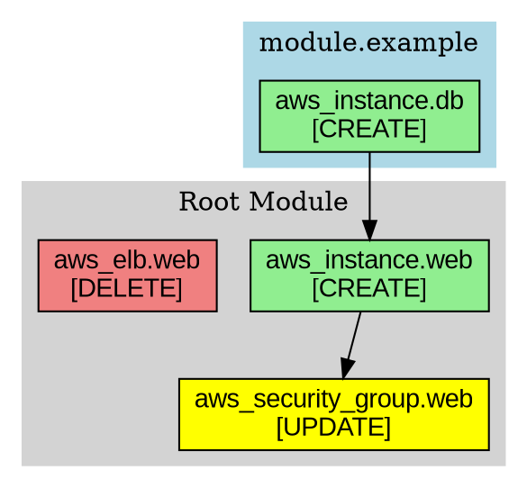
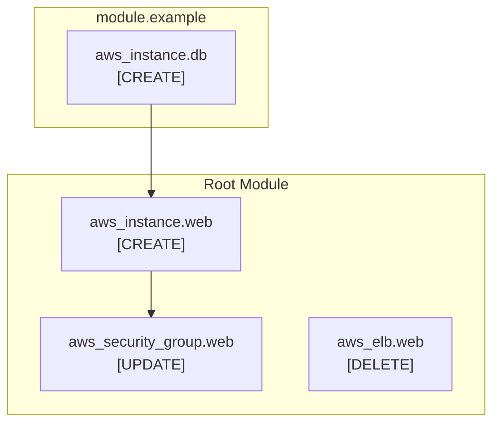

# `plan-graph` sub-command Specification

## 1. Overview

The `plan-graph` sub-command generates a visual graph representation of Terraform plan changes for the given workspace. The generated graph is designed to be easily understandable and shows relationships between resources, grouped by modules, with clear indication of resource lifecycle changes (create, update, delete).

## 2. Command Structure

```shell
terraform-ops plan-graph [OPTIONS] <PLAN_FILE>
```

### Arguments

- `<PLAN_FILE>`: Path to a Terraform plan JSON file (required)
  - Must be a valid JSON file generated by `terraform show -json <PLAN_FILE>`
  - Can be either a plan file (`.tfplan`) or state file (`.tfstate`)

### Options

- `--format <FORMAT>`: Output format for the graph (default: "graphviz")
  - Supported formats: `graphviz`, `mermaid`, `plantuml`
- `--output <FILE>`: Output file path (default: stdout)
- `--group-by <GROUPING>`: Grouping strategy for resources (default: "module")
  - Supported groupings: `module`, `action`, `resource_type`
- `--no-data-sources`: Exclude data source resources from the graph (default: false)
- `--no-outputs`: Exclude output values from the graph (default: false)
- `--no-variables`: Exclude variable values from the graph (default: false)
- `--no-locals`: Exclude local values from the graph (default: false)
- `--compact`: Generate a more compact graph layout (default: false)
- `--verbose`: Enable verbose output for debugging

## 3. Input Format

The command expects a Terraform plan JSON file that follows the [Terraform JSON Output Format](https://developer.hashicorp.com/terraform/internals/json-format) specification.

### Key Data Structures Used

#### Plan Representation

```json
{
  "format_version": "1.0",
  "prior_state": <state-representation>,
  "planned_values": <values-representation>,
  "resource_changes": [
    {
      "address": "module.example.aws_instance.web",
      "module_address": "module.example",
      "mode": "managed",
      "type": "aws_instance",
      "name": "web",
      "index": 0,
      "deposed": null,
      "actions": ["create"],
      "before": null,
      "after": <value-representation>,
      "after_unknown": <value-representation>,
      "before_sensitive": {},
      "after_sensitive": <value-representation>,
      "replace_paths": [],
      "importing": null
    }
  ],
  "configuration": <configuration-representation>
}
```

#### Values Representation

```json
{
  "root_module": {
    "resources": [
      {
        "address": "aws_instance.web",
        "mode": "managed",
        "type": "aws_instance",
        "name": "web",
        "index": 0,
        "provider_name": "registry.terraform.io/hashicorp/aws",
        "schema_version": 1,
        "values": {
          "instance_type": "t2.micro",
          "ami": "ami-12345678"
        },
        "sensitive_values": {},
        "depends_on": ["aws_security_group.web"]
      }
    ],
    "child_modules": [
      {
        "address": "module.example",
        "resources": [...],
        "child_modules": [...]
      }
    ]
  }
}
```

## 4. Output Formats

### 4.1 Graphviz (DOT) Format



### 4.2 Mermaid Format



### 4.3 PlantUML Format

```plantuml
@startuml
!theme plain
skinparam backgroundColor white
skinparam defaultFontName Arial

package "Root Module" {
  [aws_instance.web\n[CREATE]] as web
  [aws_security_group.web\n[UPDATE]] as sg
  [aws_elb.web\n[DELETE]] as elb
}

package "module.example" {
  [aws_instance.db\n[CREATE]] as db
}

web --> sg
db --> web
@enduml
```

## 5. Resource Classification

### 5.1 Action Types

Resources are classified by their planned actions:

- **CREATE** (`actions: ["create"]`): New resources to be created
  - Color: Green
  - Icon: ➕
- **UPDATE** (`actions: ["update"]`): Existing resources to be modified
  - Color: Yellow
  - Icon: 🔄
- **DELETE** (`actions: ["delete"]`): Resources to be destroyed
  - Color: Red
  - Icon: ❌
- **REPLACE** (`actions: ["delete", "create"]`): Resources to be recreated
  - Color: Orange
  - Icon: 🔄
- **NO-OP** (`actions: ["no-op"]`): No changes planned
  - Color: Grey
  - Icon: ➖

### 5.2 Module Grouping

Resources are grouped by their module address:

- **Root Module**: Resources without a `module_address`
- **Child Modules**: Resources within `module.example`, `module.database`, etc.
- **Nested Modules**: Resources within nested module structures

### 5.3 Dependency Analysis

The command analyzes resource dependencies based on:

- **Explicit Dependencies**: `depends_on` attributes in the configuration
- **Implicit Dependencies**: References between resources in the configuration
- **Data Source Dependencies**: Resources that depend on data sources

## 6. Implementation Details

### 6.1 Data Processing Pipeline

1. **JSON Parsing**: Parse the Terraform plan JSON file
2. **Resource Extraction**: Extract all resources from `resource_changes` and `planned_values`
3. **Module Grouping**: Group resources by their module address
4. **Dependency Analysis**: Build dependency graph from configuration
5. **Action Classification**: Classify resources by their planned actions
6. **Graph Generation**: Generate graph in the specified format
7. **Output Rendering**: Write the graph to the specified output

### 6.2 Error Handling

- **Invalid JSON**: Return error with details about JSON parsing failures
- **Missing Plan File**: Return error if the specified file doesn't exist
- **Unsupported Format**: Return error for unsupported output formats
- **Empty Plan**: Handle cases where no resources are planned for changes
- **Invalid Resource Data**: Skip resources with invalid data and log warnings

### 6.3 Performance Considerations

- **Large Plans**: Optimize for plans with thousands of resources
- **Memory Usage**: Stream processing for very large JSON files
- **Graph Layout**: Use efficient graph layout algorithms
- **Caching**: Cache parsed configuration for repeated operations

## 7. Usage Examples

### 7.1 Basic Usage

```shell
# Generate Graphviz graph from plan file
terraform-ops plan-graph plan.json

# Generate Mermaid graph
terraform-ops plan-graph --format mermaid plan.json

# Save to file
terraform-ops plan-graph --output graph.dot plan.json
```

### 7.2 Advanced Usage

```shell
# Generate compact graph (dependencies always shown)
terraform-ops plan-graph --compact plan.json

# Group by action type instead of module
terraform-ops plan-graph --group-by action plan.json

# Exclude specific elements
terraform-ops plan-graph --no-data-sources --no-outputs plan.json

# Verbose output for debugging
terraform-ops plan-graph --verbose plan.json
```

### 7.3 Integration with Terraform Workflow

```shell
# Generate plan and create graph in one workflow
terraform plan -out=plan.tfplan
terraform show -json plan.tfplan > plan.json
terraform-ops plan-graph plan.json > infrastructure-graph.dot
dot -Tpng infrastructure-graph.dot -o infrastructure-graph.png
```

## 8. Supported Graph Visualization Tools

- **[Graphviz](https://graphviz.org/)**: Industry-standard graph visualization tool
  - Supports complex layouts and styling
  - Excellent for large infrastructure graphs
  - Can generate PNG, SVG, PDF outputs
- **[Mermaid](https://mermaid.js.org/)**: Modern diagramming tool
  - Web-based rendering
  - Good for documentation and web interfaces
  - Supports interactive features
- **[PlantUML](https://plantuml.com/)**: UML-focused diagramming
  - Clean, professional appearance
  - Good for documentation
  - Supports various output formats

## 9. Future Enhancements

- **Interactive Graphs**: Web-based interactive graph visualization
- **Resource Details**: Click-to-expand resource configuration details
- **Change Preview**: Show before/after values for changed resources
- **Cost Estimation**: Integrate with Terraform cost estimation
- **Security Analysis**: Highlight security-related changes
- **Compliance Checks**: Visual indicators for compliance violations
- **Timeline View**: Show resource creation/destruction order
- **Export Formats**: Support for additional formats (SVG, PNG, PDF)
