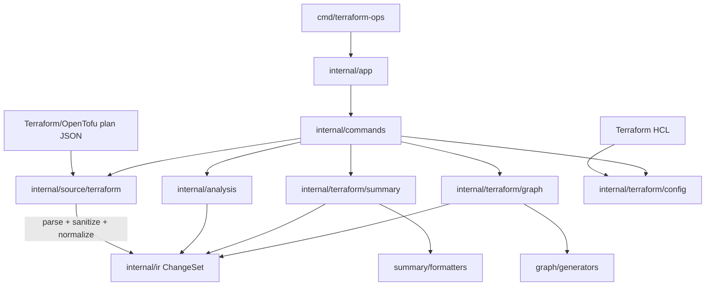
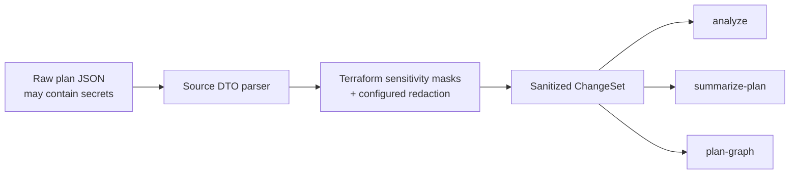
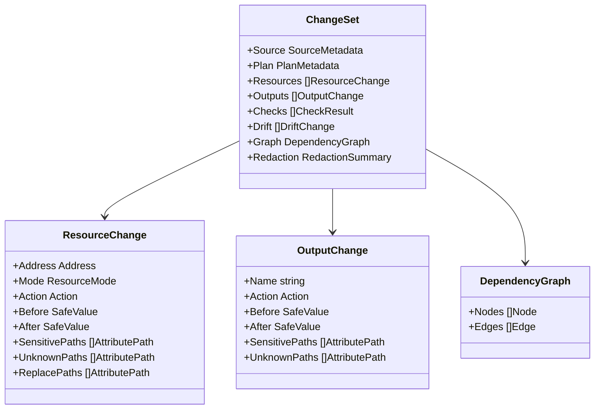
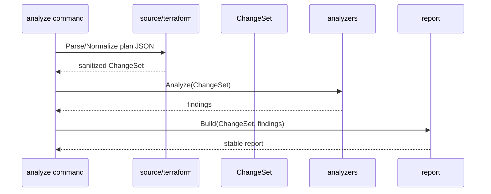
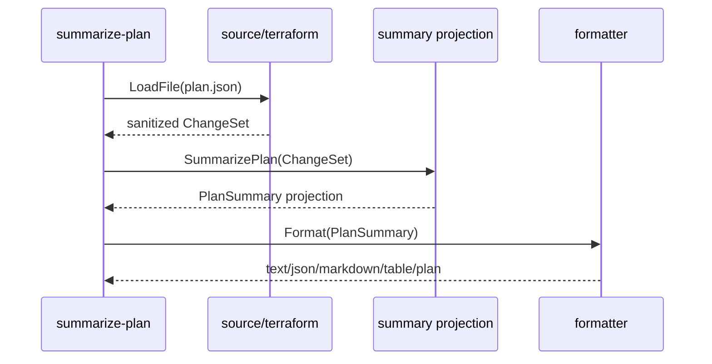
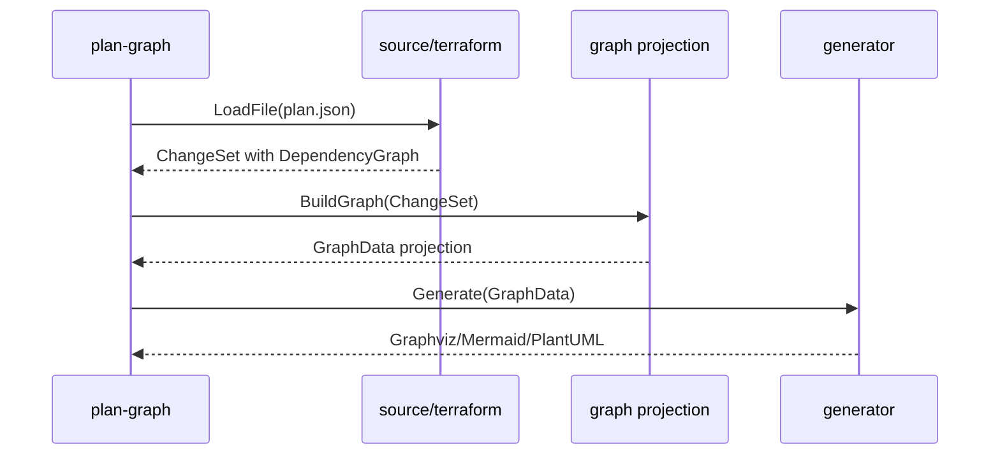

# Software Architecture

## Overview

`terraform-ops` uses a single normalized plan representation: `internal/ir.ChangeSet`.

Terraform/OpenTofu-compatible plan JSON is decoded only in `internal/source/terraform`. The source adapter sanitizes values and normalizes plan metadata, resource/output changes, checks, drift, and dependency evidence into `ChangeSet`. Application commands, analyzers, summary projections, and graph projections consume that normalized IR instead of defining or parsing competing Terraform plan models.

`show-terraform` is intentionally separate: it inspects HCL configuration blocks and therefore keeps the small `TerraformConfig` / `Backend` configuration model in `internal/core`.

## High-Level Architecture

```mermaid
flowchart TD
    CLI[cmd/terraform-ops] --> APP[internal/app]
    APP --> COMMANDS[internal/commands]

    PLAN[Terraform/OpenTofu plan JSON] --> SOURCE[internal/source/terraform]
    SOURCE -->|parse + sanitize + normalize| IR[internal/ir ChangeSet]

    COMMANDS --> SOURCE
    COMMANDS --> ANALYSIS[internal/analysis]
    COMMANDS --> SUMMARY[internal/terraform/summary]
    COMMANDS --> GRAPH[internal/terraform/graph]

    ANALYSIS --> IR
    SUMMARY --> IR
    GRAPH --> IR

    SUMMARY --> SFMT[summary/formatters]
    GRAPH --> GFMT[graph/generators]

    HCL[Terraform HCL] --> CONFIG[internal/terraform/config]
    COMMANDS --> CONFIG
```

## Plan Trust Boundary

```mermaid
flowchart LR
    RAW[Raw plan JSON\nmay contain secrets] --> PARSER[Source DTO parser]
    PARSER --> SANITIZE[Terraform sensitivity masks\n+ configured redaction]
    SANITIZE --> CHANGESET[Sanitized ChangeSet]
    CHANGESET --> ANALYZE[analyze]
    CHANGESET --> SUMMARIZE[summarize-plan]
    CHANGESET --> PLAN_GRAPH[plan-graph]
```

The architectural invariant is:

> Raw plan values do not cross from `internal/source/terraform` into command/domain logic.

Resource and output values are sanitized before being stored in `ChangeSet`. Source variable values are discarded; only variable names may be retained as non-secret dependency-graph metadata. Stable reports also avoid publishing raw normalized before/after values.

## Package Responsibilities

| Package                                 | Responsibility                                                                                       |
| --------------------------------------- | ---------------------------------------------------------------------------------------------------- |
| `internal/app`                          | Cobra application setup and command registration                                                     |
| `internal/commands`                     | CLI orchestration; loads normalized inputs and delegates to domain services/renderers                |
| `internal/ir`                           | Engine-neutral normalized `ChangeSet`, actions, safe values, findings evidence, and dependency graph |
| `internal/source/terraform`             | Bounded Terraform/OpenTofu-compatible JSON decoding, validation, sanitization, and normalization     |
| `internal/analysis`                     | Deterministic analysis rules over `ChangeSet`                                                        |
| `internal/report`                       | Stable analysis report construction and rendering                                                    |
| `internal/terraform/summary`            | Compatibility projection from `ChangeSet` to summary renderer data                                   |
| `internal/terraform/summary/formatters` | Text/JSON/Markdown/table/plan-like summary rendering                                                 |
| `internal/terraform/graph`              | Compatibility projection from `ChangeSet.Graph` to graph renderer data; no dependency discovery      |
| `internal/terraform/graph/generators`   | Graphviz/Mermaid/PlantUML rendering                                                                  |
| `internal/terraform/config`             | HCL parsing for `show-terraform`; independent of plan/change IR                                      |
| `internal/core`                         | Small renderer/configuration interfaces, options, projection types, and shared errors                |

## ChangeSet as the Single Source of Truth

```mermaid
classDiagram
    class ChangeSet {
        +Source SourceMetadata
        +Plan PlanMetadata
        +Resources []ResourceChange
        +Outputs []OutputChange
        +Checks []CheckResult
        +Drift []DriftChange
        +Graph DependencyGraph
        +Redaction RedactionSummary
    }

    class ResourceChange {
        +Address Address
        +Mode ResourceMode
        +Action Action
        +Before SafeValue
        +After SafeValue
        +SensitivePaths []AttributePath
        +UnknownPaths []AttributePath
        +ReplacePaths []AttributePath
    }

    class OutputChange {
        +Name string
        +Action Action
        +Before SafeValue
        +After SafeValue
        +SensitivePaths []AttributePath
        +UnknownPaths []AttributePath
    }

    class DependencyGraph {
        +Nodes []Node
        +Edges []Edge
    }

    ChangeSet --> ResourceChange
    ChangeSet --> OutputChange
    ChangeSet --> DependencyGraph
```

The following former plan/domain representations are intentionally removed:

- `core.TerraformPlan` and its duplicate resource/change/configuration DTO hierarchy
- the legacy `PlanParser` interface
- `internal/terraform/plan` JSON parser
- the legacy `TerraformPlan.UnmarshalJSON` compatibility layer
- the standalone graph dependency analyzer

The source `terraform.Plan` type remains deliberately private to the ingestion adapter. It represents the external JSON contract only long enough to normalize it into `ChangeSet`.

## Command Pipelines

### analyze

```mermaid
sequenceDiagram
    participant C as analyze command
    participant S as source/terraform
    participant I as ChangeSet
    participant A as analyzers
    participant R as report

    C->>S: Parse/Normalize plan JSON
    S-->>C: sanitized ChangeSet
    C->>A: Analyze(ChangeSet)
    A-->>C: findings
    C->>R: Build(ChangeSet, findings)
    R-->>C: stable report
```

### summarize-plan

```mermaid
sequenceDiagram
    participant C as summarize-plan
    participant S as source/terraform
    participant P as summary projection
    participant F as formatter

    C->>S: LoadFile(plan.json)
    S-->>C: sanitized ChangeSet
    C->>P: SummarizePlan(ChangeSet)
    P-->>C: PlanSummary projection
    C->>F: Format(PlanSummary)
    F-->>C: text/json/markdown/table/plan
```

`PlanSummary` exists only to preserve stable renderer contracts. It is not a second parsed Terraform plan model.

### plan-graph

```mermaid
sequenceDiagram
    participant C as plan-graph
    participant S as source/terraform
    participant P as graph projection
    participant G as generator

    C->>S: LoadFile(plan.json)
    S-->>C: ChangeSet with DependencyGraph
    C->>P: BuildGraph(ChangeSet)
    P-->>C: GraphData projection
    C->>G: Generate(GraphData)
    G-->>C: Graphviz/Mermaid/PlantUML
```

Dependency discovery happens exactly once during normalization. `internal/terraform/graph` filters and projects normalized graph nodes/edges for the existing renderers; it does not inspect raw Terraform expressions.

## Dependency Graph Semantics

Normalized nodes can represent:

- changed managed resources;
- changed data sources;
- root outputs;
- provided root variable names.

Normalized edges retain evidence type and confidence, including explicit `depends_on`, resource expression references, variable references, module inputs, module outputs, and output references.

`DirectDependents` and `TransitiveDependents` preserve the change-intelligence meaning of blast radius: renderer-only output/variable nodes do not inflate resource blast-radius metrics even though they remain available to `plan-graph`.

Terraform plan JSON does not expose local declaration definitions in its configuration representation, so `plan-graph --no-locals` is retained as a compatibility flag but the normalized graph does not synthesize local nodes.

## Design Principles

1. **One plan domain model** — `ChangeSet` is authoritative outside the source adapter.
2. **Sanitize before normalization boundary exit** — consumers cannot accidentally recover raw sensitive plan values.
3. **Deterministic core** — summary, graph, analysis, and reporting do not depend on an LLM.
4. **Separate semantics from presentation** — `ChangeSet` owns meaning; `PlanSummary` and `GraphData` are output projections.
5. **Engine-neutral application layer** — Terraform/OpenTofu compatibility differences belong in source adapters.
6. **Evidence-preserving graphs** — normalized edges retain kind/confidence; visual renderers may deduplicate equivalent visual edges without discarding IR evidence.
7. **Compatibility-conscious migration** — existing CLI formats and flags are retained where feasible while obsolete internal models are removed.

## Testing Strategy

- source-adapter tests prove sanitization and normalization with secret canaries;
- IR tests protect action and graph semantics;
- summary/graph unit tests construct `ChangeSet` fixtures directly;
- integration tests generate real Terraform plans and exercise all CLI formats;
- the Terraform compatibility matrix verifies supported plan JSON behavior across multiple Terraform releases;
- Trunk runs formatting, lint, dependency/security, and secret-scanning checks.
