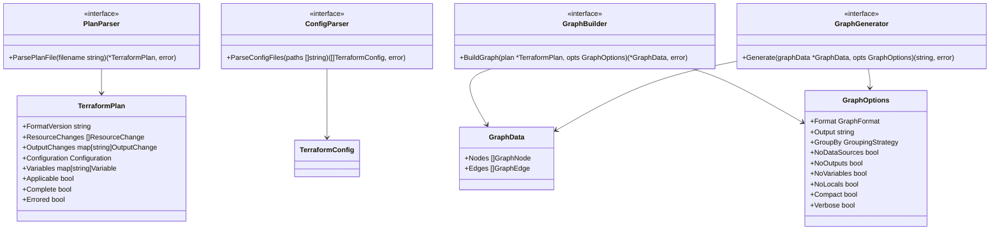

# Software Architecture

## Overview

The `internal` package contains the core application logic for the terraform-ops CLI tool. The architecture follows clean architecture principles with clear separation of concerns, dependency injection, and interface-based design.

## High-Level Architecture

## Package Structure

## Core Domain Model

## Dependency Flow

## Error Handling Architecture

## Graph Generation Pipeline

## Design Patterns

### 1. Dependency Injection

- All major components accept interfaces rather than concrete implementations
- Enables easy testing and component swapping
- Example: `PlanGraphCommand` accepts `PlanParser`, `GraphBuilder`, and `GeneratorFactory` interfaces

### 2. Factory Pattern

- `GeneratorFactory` creates appropriate graph generators based on format
- Encapsulates generator creation logic
- Supports easy addition of new formats

### 3. Strategy Pattern

- Different graph generators implement the same `GraphGenerator` interface
- Allows runtime selection of output format
- Each generator handles format-specific rendering logic

### 4. Builder Pattern

- `GraphBuilder` constructs complex `GraphData` objects
- Handles different node types and dependency analysis
- Provides fluent interface for graph construction

### 5. Error Wrapping

- Custom error types with context preservation
- Proper error chain maintenance
- User-friendly error messages with technical details

## Testing Strategy

## Key Architectural Principles

1. **Separation of Concerns**: Each package has a single responsibility
2. **Interface Segregation**: Small, focused interfaces
3. **Dependency Inversion**: High-level modules don't depend on low-level modules
4. **Single Responsibility**: Each function/class has one clear purpose
5. **Error Handling**: Comprehensive error types with proper context
6. **Testability**: All components are easily unit testable
7. **Extensibility**: Easy to add new graph formats and features

## Package Responsibilities

- **`app/`**: CLI application setup and command registration
- **`commands/`**: Command implementations with dependency injection
- **`config/`**: Application configuration management
- **`core/`**: Domain models, interfaces, and error types
- **`terraform/config/`**: Terraform configuration file parsing
- **`terraform/plan/`**: Terraform plan JSON parsing and validation
- **`terraform/graph/`**: Graph construction and dependency analysis
- **`terraform/graph/generators/`**: Format-specific graph generation

## File Organization

### Core Files

- **`app/app.go`**: Main CLI application with Cobra command setup
- **`app/app_test.go`**: Unit tests for CLI application
- **`commands/plan_graph.go`**: Plan-graph command implementation with dependency injection
- **`config/config.go`**: Application configuration management
- **`core/types.go`**: Core domain types and interfaces
- **`core/errors.go`**: Custom error types with proper wrapping
- **`core/*_test.go`**: Comprehensive unit tests for core functionality

### Terraform Integration

- **`terraform/config/parser.go`**: HCL parser for Terraform configuration files
- **`terraform/config/parser_test.go`**: Tests for configuration parsing
- **`terraform/plan/parser.go`**: JSON parser for Terraform plan files
- **`terraform/plan/parser_test.go`**: Tests for plan parsing and validation

### Graph Generation

- **`terraform/graph/builder.go`**: Graph construction from Terraform plans
- **`terraform/graph/builder_test.go`**: Tests for graph building logic
- **`terraform/graph/dependencies.go`**: Dependency analysis and edge creation
- **`terraform/graph/generators/factory.go`**: Factory for creating graph generators
- **`terraform/graph/generators/factory_test.go`**: Tests for generator factory
- **`terraform/graph/generators/graphviz.go`**: Graphviz DOT format generator
- **`terraform/graph/generators/graphviz_test.go`**: Tests for Graphviz generation
- **`terraform/graph/generators/mermaid.go`**: Mermaid format generator
- **`terraform/graph/generators/plantuml.go`**: PlantUML format generator

This architecture provides a solid foundation for the terraform-ops tool, ensuring maintainability, testability, and extensibility while following Go best practices and clean architecture principles.
